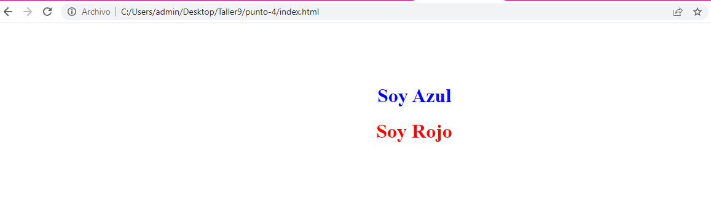
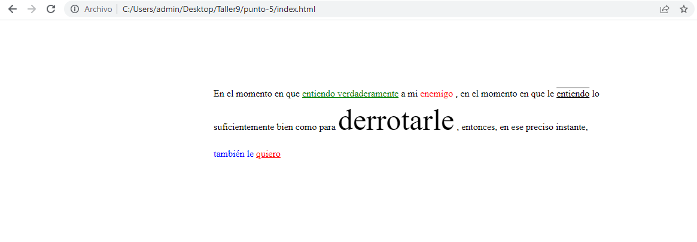
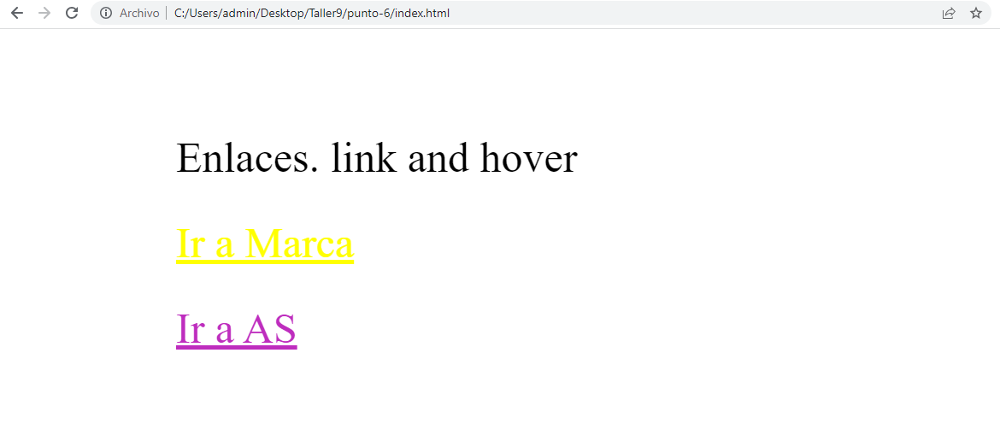
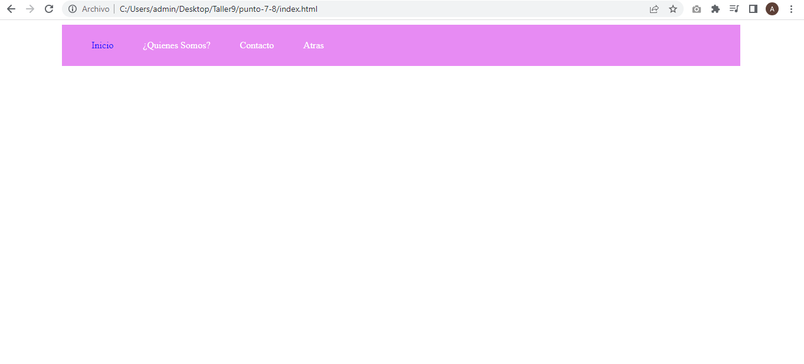
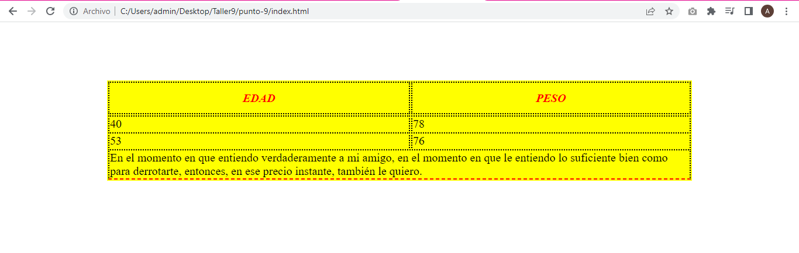

<h1>Taller Andrea Alfonso</h1>

<h2>Información<h2>

Curso Full Stack Básico - Grupo 1

Profesor Cristian Patiño

<h2>Punto 1: Links</h2>
<a href="https://www.figma.com/file/o4mQkKYlENeT0HJul3AJWy/Andrea-Alfonso---FIGMA-Excercise?type=design&node-id=8-364&t=sRIz7h5jB9mAqekC-4" target="_blank">Link de Figma</a>

 

<a href="https://katerinalfonso.github.io/Taller9/">Link Página</a>

<h2>Punto 2: HTML</h2>

<h2>Punto 3: CSS</h2>

<h2>Punto 4: Titulos</h2>

<h2>Punto 5: Textos</h2>

<h2>Punto 6: Enlaces</h2>

<h2>Punto 7-8: Navegación</h2>

<h2>Punto 9: Tablas</h2>

